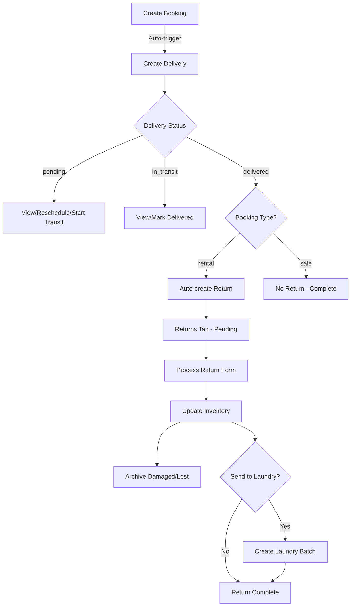

# 🚚📦 Delivery & Returns Management System - Complete Architecture

**Created**: October 16, 2025  
**Status**: In Development  
**Type**: Core Business Workflow

---

## 🎯 Business Requirements

### The Complete Flow:

```
BOOKING CREATED
    ↓ (Auto)
DELIVERY CREATED (pending)
    ↓
[View | Reschedule | Start Transit | Cancel]
    ↓
IN TRANSIT
    ↓
MARK AS DELIVERED
    ↓ (Auto - ONLY for Rentals)
ADDED TO RETURNS
    ↓
[View | Mark as Delivered/Returned]
    ↓
RETURN PROCESSING FORM:
    - For each product:
      - Qty Delivered
      - Qty Returned (clean)
      - Qty Damaged (with reason)
      - Qty Lost/Stolen (with reason)
    - Send to Laundry? ✓ (optional)
    - Notes
    ↓
INVENTORY IMPACT:
    - Returned items → stock_available++
    - Damaged items → stock_damaged++ → product_archive
    - Lost items → stock_total-- → product_archive
    - Laundry items → stock_in_laundry++ → laundry_batch
```

---

## 🗄️ Database Schema Design

### 1. **deliveries** (Enhanced)
```sql
CREATE TABLE deliveries (
  id UUID PRIMARY KEY DEFAULT gen_random_uuid(),
  delivery_number TEXT UNIQUE NOT NULL,
  
  -- Booking Link
  customer_id UUID REFERENCES customers(id),
  booking_id UUID, -- References product_orders OR package_bookings
  booking_source TEXT CHECK (booking_source IN ('product_order', 'package_booking')),
  booking_type TEXT CHECK (booking_type IN ('rental', 'sale')), -- NEW
  
  -- Delivery Details
  delivery_type TEXT DEFAULT 'standard',
  status TEXT DEFAULT 'pending' CHECK (status IN ('pending', 'in_transit', 'delivered', 'cancelled')),
  
  -- Addresses
  pickup_address TEXT,
  delivery_address TEXT NOT NULL,
  
  -- Dates & Staff
  delivery_date DATE NOT NULL,
  delivery_time TIME,
  delivered_at TIMESTAMPTZ, -- Actual delivery timestamp
  driver_name TEXT,
  vehicle_number TEXT,
  assigned_staff_id UUID,
  
  -- Costs
  delivery_charge DECIMAL(10,2) DEFAULT 0,
  fuel_cost DECIMAL(10,2) DEFAULT 0,
  total_amount DECIMAL(10,2) GENERATED ALWAYS AS (COALESCE(delivery_charge, 0) + COALESCE(fuel_cost, 0)) STORED,
  
  -- Metadata
  special_instructions TEXT,
  franchise_id UUID REFERENCES franchises(id),
  created_by UUID,
  created_at TIMESTAMPTZ DEFAULT NOW(),
  updated_at TIMESTAMPTZ DEFAULT NOW()
);

-- Trigger: Auto-create delivery when booking is created
CREATE OR REPLACE FUNCTION auto_create_delivery()
RETURNS TRIGGER AS $$
BEGIN
  INSERT INTO deliveries (
    delivery_number,
    customer_id,
    booking_id,
    booking_source,
    booking_type,
    delivery_address,
    delivery_date,
    franchise_id,
    created_by
  ) VALUES (
    'DEL-' || TO_CHAR(NOW(), 'YYYYMMDD') || '-' || LPAD(nextval('delivery_seq')::TEXT, 5, '0'),
    NEW.customer_id,
    NEW.id,
    CASE 
      WHEN TG_TABLE_NAME = 'product_orders' THEN 'product_order'
      WHEN TG_TABLE_NAME = 'package_bookings' THEN 'package_booking'
    END,
    CASE 
      WHEN TG_TABLE_NAME = 'product_orders' THEN NEW.order_type
      WHEN TG_TABLE_NAME = 'package_bookings' THEN 'rental' -- Packages are always rentals
    END,
    COALESCE(NEW.delivery_address, NEW.venue_address, 'To be confirmed'),
    COALESCE(NEW.delivery_date, NEW.event_date),
    NEW.franchise_id,
    NEW.created_by
  );
  RETURN NEW;
END;
$$ LANGUAGE plpgsql;

CREATE SEQUENCE IF NOT EXISTS delivery_seq START 1;
```

### 2. **returns** (New Table)
```sql
CREATE TABLE returns (
  id UUID PRIMARY KEY DEFAULT gen_random_uuid(),
  return_number TEXT UNIQUE NOT NULL, -- RET-YYYYMMDD-00001
  
  -- Links
  delivery_id UUID REFERENCES deliveries(id) ON DELETE CASCADE,
  booking_id UUID REFERENCES bookings(id), -- Generic reference
  booking_source TEXT CHECK (booking_source IN ('product_order', 'package_booking')),
  customer_id UUID REFERENCES customers(id),
  
  -- Return Info
  status TEXT DEFAULT 'pending' CHECK (status IN ('pending', 'processing', 'completed', 'cancelled')),
  return_date DATE NOT NULL,
  processed_at TIMESTAMPTZ,
  processed_by UUID REFERENCES users(id),
  
  -- Send to Laundry
  send_to_laundry BOOLEAN DEFAULT false,
  laundry_batch_id UUID REFERENCES laundry_batches(id),
  
  -- Notes
  notes TEXT,
  damage_notes TEXT,
  
  -- Metadata
  franchise_id UUID REFERENCES franchises(id),
  created_at TIMESTAMPTZ DEFAULT NOW(),
  updated_at TIMESTAMPTZ DEFAULT NOW()
);

CREATE INDEX idx_returns_delivery ON returns(delivery_id);
CREATE INDEX idx_returns_booking ON returns(booking_id);
CREATE INDEX idx_returns_status ON returns(status);
```

### 3. **return_items** (New Table)
```sql
CREATE TABLE return_items (
  id UUID PRIMARY KEY DEFAULT gen_random_uuid(),
  return_id UUID REFERENCES returns(id) ON DELETE CASCADE,
  product_id UUID REFERENCES products(id),
  
  -- Quantities
  qty_delivered INT NOT NULL DEFAULT 0,
  qty_returned INT NOT NULL DEFAULT 0, -- Clean items
  qty_damaged INT NOT NULL DEFAULT 0,
  qty_lost INT NOT NULL DEFAULT 0,
  
  -- Reasons & Details
  damage_reason TEXT,
  damage_description TEXT,
  lost_reason TEXT CHECK (lost_reason IN ('stolen', 'lost', 'other')),
  lost_description TEXT,
  
  -- Actions
  archived BOOLEAN DEFAULT false, -- If damaged/lost items archived
  sent_to_laundry BOOLEAN DEFAULT false,
  
  -- Notes
  notes TEXT,
  
  created_at TIMESTAMPTZ DEFAULT NOW()
);

CREATE INDEX idx_return_items_return ON return_items(return_id);
CREATE INDEX idx_return_items_product ON return_items(product_id);
```

### 4. **product_archive** (Enhanced)
```sql
-- Add return-related fields
ALTER TABLE product_archive ADD COLUMN IF NOT EXISTS return_id UUID REFERENCES returns(id);
ALTER TABLE product_archive ADD COLUMN IF NOT EXISTS delivery_id UUID REFERENCES deliveries(id);
ALTER TABLE product_archive ADD COLUMN IF NOT EXISTS quantity INT DEFAULT 1;
ALTER TABLE product_archive ADD COLUMN IF NOT EXISTS damage_reason TEXT;
ALTER TABLE product_archive ADD COLUMN IF NOT EXISTS lost_reason TEXT;
```

### 5. **laundry_batches** (Link to Returns)
```sql
-- Add return reference
ALTER TABLE laundry_batches ADD COLUMN IF NOT EXISTS return_id UUID REFERENCES returns(id);
ALTER TABLE laundry_batches ADD COLUMN IF NOT EXISTS auto_created BOOLEAN DEFAULT false;
```

---

## 🔄 Business Logic & Workflows

### Workflow 1: Auto-Create Delivery on Booking
```typescript
// Trigger automatically fires when:
// 1. product_orders row inserted
// 2. package_bookings row inserted

// Database trigger creates:
{
  delivery_number: "DEL-20251016-00001",
  booking_id: booking.id,
  booking_source: "product_order" | "package_booking",
  booking_type: "rental" | "sale",
  status: "pending",
  delivery_address: booking.delivery_address || booking.venue_address,
  delivery_date: booking.delivery_date || booking.event_date
}
```

### Workflow 2: Delivery Status Transitions
```typescript
// Status Flow:
pending → in_transit → delivered → (auto-create return if rental)

// Actions per status:
{
  pending: ["View", "Reschedule", "Start Transit", "Cancel"],
  in_transit: ["View", "Mark as Delivered", "Cancel"],
  delivered: ["View"],
  cancelled: ["View"]
}

// When status changes to 'delivered' AND booking_type = 'rental':
// Auto-create return record
```

### Workflow 3: Return Processing
```typescript
// Return Form Submission:
async function processReturn(data: {
  return_id: string
  items: Array<{
    product_id: string
    qty_delivered: number
    qty_returned: number
    qty_damaged: number
    qty_lost: number
    damage_reason?: string
    lost_reason?: 'stolen' | 'lost' | 'other'
    damage_description?: string
    lost_description?: string
  }>
  send_to_laundry: boolean
  notes?: string
}) {
  // 1. Validate quantities
  for (const item of data.items) {
    if (item.qty_returned + item.qty_damaged + item.qty_lost !== item.qty_delivered) {
      throw new Error('Quantity mismatch')
    }
  }
  
  // 2. Insert return_items
  await supabase.from('return_items').insert(data.items.map(item => ({
    return_id: data.return_id,
    ...item
  })))
  
  // 3. Update inventory
  for (const item of data.items) {
    const product = await getProduct(item.product_id)
    
    await supabase.from('products').update({
      stock_available: product.stock_available + item.qty_returned,
      stock_damaged: product.stock_damaged + item.qty_damaged,
      stock_total: product.stock_total - item.qty_lost,
      stock_in_laundry: data.send_to_laundry 
        ? product.stock_in_laundry + item.qty_returned
        : product.stock_in_laundry
    }).eq('id', item.product_id)
    
    // 4. Archive damaged/lost items
    if (item.qty_damaged > 0) {
      await supabase.from('product_archive').insert({
        product_id: item.product_id,
        product_name: product.name,
        category: product.category,
        reason: 'damaged',
        quantity: item.qty_damaged,
        damage_reason: item.damage_reason,
        notes: item.damage_description,
        return_id: data.return_id,
        archived_by: currentUser.id
      })
    }
    
    if (item.qty_lost > 0) {
      await supabase.from('product_archive').insert({
        product_id: item.product_id,
        product_name: product.name,
        category: product.category,
        reason: item.lost_reason === 'stolen' ? 'stolen' : 'lost',
        quantity: item.qty_lost,
        lost_reason: item.lost_reason,
        notes: item.lost_description,
        return_id: data.return_id,
        archived_by: currentUser.id
      })
    }
  }
  
  // 5. Create laundry batch if needed
  if (data.send_to_laundry) {
    const laundryItems = data.items
      .filter(i => i.qty_returned > 0)
      .map(i => ({
        product_id: i.product_id,
        quantity: i.qty_returned,
        condition_before: 'dirty'
      }))
    
    const batch = await createLaundryBatch({
      return_id: data.return_id,
      items: laundryItems,
      auto_created: true,
      notes: `Auto-created from return ${data.return_id}`
    })
    
    await supabase.from('returns').update({
      laundry_batch_id: batch.id
    }).eq('id', data.return_id)
  }
  
  // 6. Mark return as completed
  await supabase.from('returns').update({
    status: 'completed',
    processed_at: new Date(),
    processed_by: currentUser.id
  }).eq('id', data.return_id)
}
```

### Workflow 4: Rental vs Sale Logic
```typescript
// Only create returns for RENTALS
function shouldCreateReturn(booking: Booking): boolean {
  if (booking.booking_source === 'product_order') {
    // Check order_type in product_orders
    return booking.order_type === 'rental'
  }
  
  if (booking.booking_source === 'package_booking') {
    // Package bookings are ALWAYS rentals
    return true
  }
  
  return false
}

// In delivery mark-as-delivered handler:
if (delivery.status === 'delivered' && shouldCreateReturn(booking)) {
  await createReturnRecord(delivery, booking)
}
```

---

## 📱 UI Components

### Deliveries Page (`/deliveries`)

#### Tabs:
1. **Deliveries** - All deliveries with action buttons
2. **Returns** - Pending returns (auto-populated from delivered rentals)

#### Deliveries Tab Actions:
```typescript
const deliveryActions = {
  pending: [
    { label: "View", icon: Eye, action: viewDelivery },
    { label: "Reschedule", icon: Calendar, action: rescheduleDelivery },
    { label: "Start Transit", icon: Truck, action: startTransit },
    { label: "Cancel", icon: XCircle, action: cancelDelivery }
  ],
  in_transit: [
    { label: "View", icon: Eye, action: viewDelivery },
    { label: "Mark as Delivered", icon: CheckCircle, action: markDelivered },
    { label: "Cancel", icon: XCircle, action: cancelDelivery }
  ],
  delivered: [
    { label: "View", icon: Eye, action: viewDelivery }
  ]
}
```

#### Returns Tab:
- Shows only deliveries where:
  - `status = 'delivered'`
  - `booking_type = 'rental'`
  - Return not yet processed
- Action buttons:
  - **View** - See return details
  - **Process Return** - Opens return processing dialog

### Return Processing Dialog

```typescript
interface ReturnFormItem {
  product_id: string
  product_name: string
  qty_delivered: number
  qty_returned: number  // Clean items
  qty_damaged: number
  qty_lost: number
  damage_reason?: string
  damage_description?: string
  lost_reason?: 'stolen' | 'lost' | 'other'
  lost_description?: string
}

interface ReturnFormData {
  items: ReturnFormItem[]
  send_to_laundry: boolean
  notes: string
}

// Form Structure:
<Dialog>
  <DialogHeader>Process Return - {delivery.delivery_number}</DialogHeader>
  
  <ScrollArea>
    {items.map(item => (
      <Card key={item.product_id}>
        <h4>{item.product_name}</h4>
        
        <div className="grid grid-cols-4 gap-4">
          <Input 
            label="Delivered" 
            value={item.qty_delivered} 
            disabled 
          />
          
          <Input 
            label="Returned (Clean)" 
            value={item.qty_returned}
            onChange={handleReturnedChange}
          />
          
          <Input 
            label="Damaged" 
            value={item.qty_damaged}
            onChange={handleDamagedChange}
          />
          
          <Input 
            label="Lost/Stolen" 
            value={item.qty_lost}
            onChange={handleLostChange}
          />
        </div>
        
        {item.qty_damaged > 0 && (
          <>
            <Select 
              label="Damage Reason"
              options={damageReasons}
              value={item.damage_reason}
            />
            <Textarea 
              label="Damage Description"
              value={item.damage_description}
            />
          </>
        )}
        
        {item.qty_lost > 0 && (
          <>
            <Select 
              label="Lost Reason"
              options={['stolen', 'lost', 'other']}
              value={item.lost_reason}
            />
            <Textarea 
              label="Lost Description"
              value={item.lost_description}
            />
          </>
        )}
      </Card>
    ))}
  </ScrollArea>
  
  <Checkbox 
    label="Send clean items to laundry?"
    checked={form.send_to_laundry}
  />
  
  <Textarea 
    label="Notes"
    value={form.notes}
  />
  
  <Alert variant="info">
    <Info className="h-4 w-4" />
    <AlertDescription>
      <strong>Inventory Impact:</strong>
      <ul>
        <li>Returned: +{totalReturned} to Available Stock</li>
        <li>Damaged: +{totalDamaged} to Damaged Stock → Archive</li>
        <li>Lost: -{totalLost} from Total Stock → Archive</li>
        {form.send_to_laundry && (
          <li>Laundry: +{totalReturned} to Laundry Stock</li>
        )}
      </ul>
    </AlertDescription>
  </Alert>
  
  <DialogFooter>
    <Button onClick={handleSubmit}>Process Return</Button>
  </DialogFooter>
</Dialog>
```

---

## 🔌 API Endpoints

### Deliveries APIs

#### `POST /api/deliveries/auto-create`
Auto-create delivery (also handled by trigger)
```typescript
{
  booking_id: string
  booking_source: 'product_order' | 'package_booking'
}
```

#### `PATCH /api/deliveries/[id]/status`
Update delivery status
```typescript
{
  status: 'in_transit' | 'delivered' | 'cancelled'
  notes?: string
}
```

### Returns APIs

#### `GET /api/returns`
Get all pending returns
```typescript
// Response:
{
  returns: Array<{
    id: string
    return_number: string
    delivery: Delivery
    booking: Booking
    customer: Customer
    items: Array<Product>
    status: string
  }>
}
```

#### `POST /api/returns/[id]/process`
Process a return
```typescript
{
  items: Array<{
    product_id: string
    qty_delivered: number
    qty_returned: number
    qty_damaged: number
    qty_lost: number
    damage_reason?: string
    damage_description?: string
    lost_reason?: string
    lost_description?: string
  }>
  send_to_laundry: boolean
  notes?: string
}
```

#### `GET /api/returns/[id]/inventory-impact`
Preview inventory changes before processing
```typescript
// Response:
{
  products: Array<{
    product_id: string
    product_name: string
    current_stock: {
      available: number
      damaged: number
      total: number
      in_laundry: number
    }
    new_stock: {
      available: number
      damaged: number
      total: number
      in_laundry: number
    }
    changes: {
      available: +5
      damaged: +2
      total: -1
      in_laundry: +5
    }
  }>
}
```

---

## ✅ Validation Rules

### Return Processing Validation:
1. ✓ `qty_returned + qty_damaged + qty_lost = qty_delivered`
2. ✓ All quantities must be >= 0
3. ✓ If `qty_damaged > 0`, damage_reason is required
4. ✓ If `qty_lost > 0`, lost_reason is required
5. ✓ Cannot process return twice (check return.status)
6. ✓ Delivery must be status='delivered'
7. ✓ Booking must be rental type

### Inventory Validation:
1. ✓ Stock levels cannot go negative
2. ✓ `stock_total >= stock_available + stock_booked + stock_damaged + stock_in_laundry`
3. ✓ Lost items reduce stock_total permanently

---

## 🎨 UI States & Messages

### Success Messages:
- ✅ "Delivery started - Status updated to in transit"
- ✅ "Delivery marked as delivered - Added to returns"
- ✅ "Return processed successfully - Inventory updated"
- ✅ "Items archived - {qty} items moved to product archive"
- ✅ "Laundry batch created - {qty} items sent to laundry"

### Error Messages:
- ❌ "Cannot process return - Quantities don't match"
- ❌ "Damage reason required for damaged items"
- ❌ "Return already processed"
- ❌ "Delivery not completed yet"
- ❌ "Cannot create return for sales orders"

### Warning Messages:
- ⚠️ "This will permanently reduce stock by {qty} items"
- ⚠️ "{qty} items will be archived as damaged/lost"
- ⚠️ "Clean items will be sent to laundry - available after cleaning"

---

## 📊 Data Flow Diagram



---

## 🚀 Implementation Priority

### Phase 1 (High Priority):
1. ✅ Update database schema (deliveries, returns, return_items)
2. ✅ Create auto-delivery trigger
3. ✅ Build deliveries page UI with action buttons
4. ✅ Implement status transitions

### Phase 2 (Core Features):
5. ✅ Build returns tab
6. ✅ Create return processing dialog
7. ✅ Implement inventory impact logic
8. ✅ Connect to product archive

### Phase 3 (Integration):
9. ✅ Integrate laundry system
10. ✅ Build all API endpoints
11. ✅ Add validation & error handling

### Phase 4 (Testing & Polish):
12. ✅ End-to-end testing
13. ✅ UI polish & loading states
14. ✅ Documentation & training

---

## 🔒 Permissions & Security

### Role-Based Access:
- **Super Admin**: Full access to all deliveries/returns
- **Franchise Admin**: Access to own franchise only
- **Staff**: Can process deliveries/returns for assigned franchise
- **Driver**: Can update delivery status only

### RLS Policies:
```sql
-- Deliveries RLS
CREATE POLICY "Users can view own franchise deliveries"
ON deliveries FOR SELECT
USING (franchise_id IN (SELECT franchise_id FROM user_franchise_access WHERE user_id = auth.uid()));

-- Returns RLS
CREATE POLICY "Users can process own franchise returns"
ON returns FOR ALL
USING (franchise_id IN (SELECT franchise_id FROM user_franchise_access WHERE user_id = auth.uid()));
```

---

## 📈 Future Enhancements

1. **SMS/WhatsApp Notifications**
   - Notify customer when delivery is out for delivery
   - Send return reminder 1 day before return date
   
2. **Driver Mobile App**
   - Real-time status updates
   - Photo proof of delivery
   - Digital signature capture

3. **Advanced Analytics**
   - Delivery success rate
   - Average return processing time
   - Damage/loss trends by product category

4. **Barcode Scanning**
   - Scan products during delivery
   - Scan products during return
   - Auto-populate quantities

5. **Partial Returns**
   - Return items in multiple batches
   - Track pending vs completed returns

---

**Status**: Architecture Complete ✅  
**Next**: Begin Phase 1 Implementation
