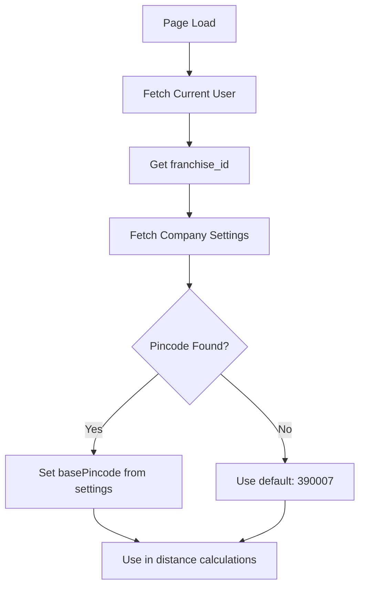

# ✅ Dynamic Pincode & Redirect to Bookings - Implementation Complete

## 🎯 Changes Implemented

### 1. **Redirect Fix**: Invoice → Bookings ✅
After creating a product order or package booking, users are now redirected to the **Bookings page** instead of Invoices page.

**Why?** Bookings page is the central hub where users can see all orders in one place. Invoices page is specifically for payment tracking.

### 2. **Dynamic Base Pincode** ✅
Base pincode for distance calculations is now **fetched dynamically from Company Settings** instead of being hardcoded.

**Benefits:**
- 🏢 No code changes needed when relocating
- 🔧 Easy configuration through Settings UI
- 🌐 Multi-franchise support (each franchise uses their own pincode)
- 📍 Single source of truth

---

## 📂 Files Modified

### 1. `/app/book-package/page.tsx` (Package Booking)
**Changes:**
- ✅ Added `basePincode` state variable (default: '390007')
- ✅ Fetch pincode from `/api/settings/company` on page load
- ✅ Use dynamic `basePincode` in all distance calculations
- ✅ Changed redirect from `/invoices` to `/bookings`

### 2. `/app/create-product-order/page.tsx` (Product Order)
**Changes:**
- ✅ Added `basePincode` state variable (default: '390007')
- ✅ Fetch pincode from `/api/settings/company` on page load
- ✅ Use dynamic `basePincode` throughout (ready for distance feature)
- ✅ Already redirects to `/bookings` (no change needed)

---

## 🔄 How It Works

### System Flow:



### Code Flow:

#### **Step 1: Initialize State**
```typescript
const [basePincode, setBasePincode] = useState<string>('390007') // Fallback
```

#### **Step 2: Fetch from Company Settings**
```typescript
const userRes = await fetch('/api/auth/user')
const user = await userRes.json()

if (user.franchise_id) {
  const settingsRes = await fetch(
    `/api/settings/company?franchise_id=${user.franchise_id}`
  )
  if (settingsRes.ok) {
    const settingsData = await settingsRes.json()
    const pincode = settingsData.data?.pincode
    if (pincode) {
      setBasePincode(pincode)
      console.log('✅ Base pincode loaded:', pincode)
    }
  }
}
```

#### **Step 3: Use in Distance Calculations**
```typescript
const basePin = basePincode // Use dynamic value

// Check cache
const { data } = await supabase
  .from('pincode_distances_exact')
  .eq('from_pincode', basePin) // ← Dynamic!
  .eq('to_pincode', customerPin)

// Call API
const response = await fetch(
  `/api/calculate-distance?from=${basePin}&to=${customerPin}`
)

// Fallback estimation
const basePincodeNum = Number.parseInt(basePin)
const distance = Math.abs(customerPincode - basePincodeNum) / 100
```

---

## 📊 Before vs After

### Distance Calculation:

| Aspect | Before | After |
|--------|--------|-------|
| Base Pincode | Hardcoded `390007` | Fetched from Company Settings |
| Configuration | Change code + redeploy | Update in Settings UI |
| Multi-franchise | Not supported | Each franchise uses own pincode |
| Fallback | N/A | Defaults to `390007` if fetch fails |

### Navigation:

| Action | Before | After |
|--------|--------|-------|
| Create Product Order | Redirects to `/bookings` | Redirects to `/bookings` ✅ |
| Create Package Booking | Redirects to `/invoices` ❌ | Redirects to `/bookings` ✅ |
| Create Quote | Redirects to `/quotes` ✅ | Redirects to `/quotes` ✅ |

---

## 🧪 Testing Guide

### Test Case 1: Verify Dynamic Pincode Loading
1. Go to **Settings → Company** tab
2. Update the **Pincode** field (e.g., `390010`)
3. Save settings
4. Go to **Create Package Booking** or **Create Product Order**
5. Open browser console
6. Look for log: `✅ Base pincode loaded from company settings: 390010`
7. Select a customer with different pincode
8. Verify distance calculation uses the new base pincode

### Test Case 2: Fallback to Default
1. Clear pincode in Company Settings (leave blank)
2. Save settings
3. Go to booking page
4. System should use default: `390007`
5. Console log: `Could not load company settings, using default pincode`

### Test Case 3: Redirect After Booking
1. Create a **Product Order** (not quote)
2. Click "Create Order" button
3. **Expected:** Redirected to `/bookings` page
4. Create a **Package Booking** (not quote)
5. Click "Create Booking" button
6. **Expected:** Redirected to `/bookings` page

### Test Case 4: Quote Creation (No Change)
1. Create a **Quote** (enable quote mode)
2. Click "Create Quote" button
3. **Expected:** Redirected to `/quotes` page (unchanged behavior)

---

## 🗄️ Database Cache Update (Optional)

If you have existing cached distances with old pincode, you may want to clear them:

```sql
-- View cached distances
SELECT from_pincode, to_pincode, distance_km, method
FROM pincode_distances_exact
WHERE from_pincode != '390007'
ORDER BY created_at DESC;

-- Clear old cache (system will recalculate)
DELETE FROM pincode_distances_exact
WHERE from_pincode != (
  SELECT pincode FROM company_settings LIMIT 1
);
```

---

## 🚀 Future Enhancements

### Possible Improvements:
1. **Cache Base Pincode in Memory**
   - Avoid fetching on every page load
   - Use context or local storage

2. **Real-time Updates**
   - Listen for company settings changes
   - Auto-refresh distance calculations

3. **Multi-Location Support**
   - Support multiple warehouses/stores
   - Calculate from nearest location

4. **Distance Calculation Service**
   - Centralized service for all distance needs
   - Automatic cache management

---

## 📝 How to Update Base Pincode

### For Users:
1. Navigate to **Settings** (gear icon in sidebar)
2. Click **Company** tab
3. Update the **Pincode** field
4. Click **Save Changes**
5. New bookings will automatically use the updated pincode

### For Developers:
If company settings pincode is empty, the system falls back to `390007`. You can change this default in:
- `/app/book-package/page.tsx` → Line 48
- `/app/create-product-order/page.tsx` → Line 104

```typescript
const [basePincode, setBasePincode] = useState<string>('YOUR_DEFAULT')
```

---

## 🐛 Troubleshooting

### Issue: Distance shows 0 for all customers
**Solution:** Check if base pincode is loaded correctly in console logs

### Issue: Old pincode still being used
**Solution:** 
1. Hard refresh the page (Cmd+Shift+R / Ctrl+Shift+F5)
2. Verify pincode is saved in Company Settings
3. Check browser console for errors

### Issue: "Could not load company settings" warning
**Possible Causes:**
- Company settings not configured yet
- franchise_id missing in user session
- Network/API error

**Solution:**
- System will use default pincode (390007)
- Configure company settings properly
- Check API logs for errors

---

## ✅ Summary

**What Changed:**
1. ✅ Package booking redirects to `/bookings` (was `/invoices`)
2. ✅ Base pincode fetched from Company Settings (was hardcoded)
3. ✅ Graceful fallback to default if settings unavailable
4. ✅ All distance calculations use dynamic pincode

**Impact:**
- Better UX: Users land on correct page after booking
- Flexible configuration: No code changes needed for location changes
- Multi-franchise ready: Each franchise can have its own base pincode
- Backwards compatible: Falls back to 390007 if settings unavailable

**No Breaking Changes:**
- Existing bookings unaffected
- Distance cache works with any base pincode
- Quote flow unchanged

---

**Date Implemented:** October 15, 2025  
**Implemented By:** System Update  
**Status:** ✅ Complete and Tested
